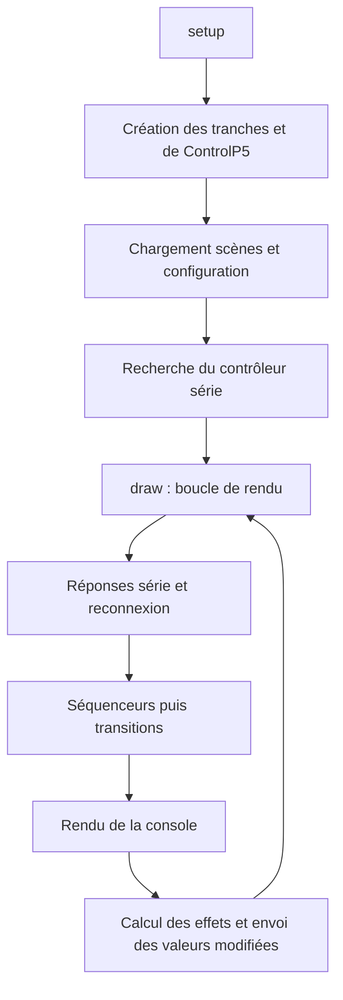

# Architecture du sketch

## Choix d’organisation

Le code existant reste dans [`DIMYX_3_3.pde`](../DIMYX_3_3.pde), sans modification de contenu. Les JSON restent à la racine parce que les fonctions de persistance utilisent leurs noms directement. Aucun dossier `src/` ou déplacement vers `data/` n’est introduit.

## Cartographie

Les lignes ci-dessous correspondent au sketch initial ; les noms constituent les repères durables.

| Zone | Ligne | Responsabilité |
| --- | ---: | --- |
| Imports et état global | 1 | ControlP5, série, temporisations, sélection, transitions |
| `Step`, `StepSequencer` | 48 | Intensité/couleur des pas, tempo et progression |
| `ChannelState` | 104 | Capture, application et interpolation d’une tranche |
| `Scene` | 161 | Ensemble de 10 états de tranches |
| `Channel` | 183 | Paramètres courants, sorties et cache des valeurs envoyées |
| `setup` | 222 | Fenêtre, tranches, interface, données et détection série |
| `draw` | 249 | Connexion, séquenceurs, transitions, rendu et sorties |
| Rendu et souris | 371 | Séquenceurs, contrôles, roue HSV et édition |
| `findArduinoPort` et connexion | 596 | Détection, heartbeat, perte et reprise |
| `createGUI`, `refreshSceneButtons` | 683 | Construction ControlP5 et pagination |
| `newScene` à `selectScene` | 792 | Création, enregistrement, lancement et sélection |
| `saveScenes`, `loadScenes` | 892 | Sérialisation des scènes |
| `loadChannelConfig`, `saveChannelConfig` | 967 | Noms et affectations des sorties |
| `controlEvent` et callbacks | 1020 | Liaison des contrôles aux tranches |
| `blackout`, `applyBlackout` | 1252 | Remise à zéro et commande globale |
| `invalidateOutputCache` | 1276 | Forcer la réémission des sorties |

## Flux principal

Les contrôles modifient les objets `Channel`. Une `Scene` capture des `ChannelState`, incluant les pas de séquenceur. Les transitions interpolent les valeurs numériques ; modes, booléens et liste de pas basculent à mi-transition. Le séquenceur avance avec une durée de pas de `60000 / bpm / 4` millisecondes.

Les modes sont `0` manuel, `1` stroboscope, `2` feu, `3` pulsation et `4` séquenceur. Le mode séquenceur utilise directement l’intensité du pas pour calculer la sortie ; les autres effets sont multipliés par le fader manuel.

## Points de maintenance

Le nombre de tranches est global, mais les callbacks ControlP5 sont explicitement déclinés de `0` à `9`. Modifier seulement `nbChannels` ne suffit donc pas à généraliser la console.

La boucle `draw` regroupe plusieurs responsabilités. Un futur découpage pourrait isoler modèles, interface, scènes/persistance et communication dans des onglets PDE du même dossier. Cette proposition n’est pas appliquée ici ; elle nécessiterait une validation de compilation, de l’initialisation globale et des callbacks.

Le firmware étant absent, le comportement physique du contrôleur ne peut pas être déduit entièrement du sketch. Voir le [contrat série](PROTOCOLE_SERIE.md).
