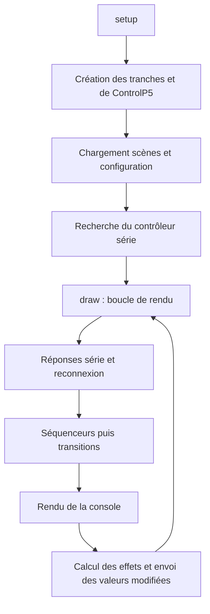

# Architecture du sketch

## Choix d’organisation

Le code reste dans [`DIMYX_3_3.pde`](../DIMYX_3_3.pde). Les JSON restent à la racine parce que les fonctions de persistance utilisent leurs noms directement. Aucun dossier `src/` ou déplacement vers `data/` n’est introduit.

## Cartographie

Les lignes ci-dessous correspondent au sketch initial ; les noms constituent les repères durables.

| Zone | Ligne | Responsabilité |
| --- | ---: | --- |
| Imports et état global | 1 | ControlP5, série, temporisations, sélection, transitions |
| `Step`, `StepSequencer` | 48 | Intensité/couleur des pas, tempo et progression |
| `ChannelState` | 104 | Capture, application et interpolation d’une tranche |
| `Scene` | 161 | Ensemble de 10 états de tranches |
| `Channel` | 183 | Paramètres courants, sorties et cache des valeurs envoyées |
| `setup` | 222 | Fenêtre, tranches, interface, données et détection série |
| `draw` | 249 | Connexion, séquenceurs, transitions, rendu et sorties |
| Rendu et souris | 371 | Séquenceurs, contrôles, roue HSV et édition |
| `findArduinoPort` et connexion | 596 | Détection, heartbeat, perte et reprise |
| `createGUI`, `refreshSceneButtons` | 683 | Construction ControlP5 et pagination |
| `newScene` à `selectScene` | 792 | Création, enregistrement, lancement et sélection |
| `saveScenes`, `loadScenes` | 892 | Sérialisation des scènes |
| `loadChannelConfig`, `saveChannelConfig` | 967 | Noms et affectations des sorties |
| `controlEvent` et callbacks | 1020 | Liaison des contrôles aux tranches |
| `blackout`, `applyBlackout` | 1252 | Remise à zéro et commande globale |
| `invalidateOutputCache` | 1276 | Forcer la réémission des sorties |

## Flux principal

Les contrôles modifient les objets `Channel`. Une `Scene` capture des `ChannelState`, incluant les pas de séquenceur. Les transitions interpolent les valeurs numériques ; modes, booléens et liste de pas basculent à mi-transition. Le séquenceur avance avec une durée de pas de `60000 / bpm / 4` millisecondes.

Les effets sont `0` sans modulation (MAN), `1` stroboscope, `2` feu et `3` pulsation. `sequencer.active` choisit indépendamment la source : intensité/couleur du pas courant ou fader/couleur manuels. La sortie est l’intensité source multipliée par le facteur d’effet. Le minimum conserve son calcul existant (`fxMin / 4095`) comme plancher du facteur ; il ne rallume pas un pas nul.

`toggleSeq` initialise le premier pas si nécessaire et redémarre au premier pas lors d’une activation. Le choix d’effet ne modifie plus le séquenceur. La synchronisation du bouton SEQ depuis les scènes désactive temporairement ses événements pour ne pas redémarrer la lecture. Le code historique `fx: 4` est converti en `FX_MANUAL` au chargement, sans modifier `sa` ni les pas.

## Interface adaptative

`settings` dimensionne la fenêtre selon l’écran ; `setup` active le redimensionnement. `layoutInterface` recalcule les positions et dimensions lors d’un changement de taille, de page ou de vue. Il actualise aussi la surface de référence de ControlP5 pour conserver des zones de clic correctes après agrandissement. Les événements sont suspendus pendant cette opération.

La largeur minimale d’une cellule de tranche est de 148 pixels. `channelsPerPage`, `channelPage` et `channelVisible` déterminent les tranches affichées. Toutes les tranches restent traitées dans `draw` : la pagination ne change ni les séquenceurs, ni les transitions, ni les sorties. Sous 1000 pixels de largeur, `scenesView` remplace les tranches par les scènes. `outputsView` affiche la configuration matérielle et les ports USB. Le blackout reste en dehors de ces vues.

`channelX`, `stepsX`, `stepsY` et `wheelY` servent au rendu et à la détection des clics. Les espaces entre les pas sont inactifs. La suppression d’un pas recadre l’index de lecture pour éviter un accès au-delà du dernier pas.

`CapsuleButtonView`, `CapsuleSliderView` et `ChipView` dessinent les contrôles ControlP5. Les sliders conservent leur traitement natif du glissement. `CapsuleTextfield` conserve la saisie de Textfield et remplace son dessin, avec défilement du texte autour du curseur ; un champ masqué perd le focus clavier.

Le bouton `effect_` ouvre quatre choix `fxChoice_` en capsules, sans changer la valeur. Le choix applique directement le mode. L’ouverture et la fermeture du menu, y compris par clic extérieur, passent par `layoutPending` et `pendingEffectMenuChannel` : `draw` applique le layout après relâchement de la souris pour éviter de remplacer les contrôles pendant un clic ControlP5. Le séquenceur reste indépendant. `refreshPortButtons` construit des pages de six boutons de ports à partir de `availablePorts` ; `refreshPorts` actualise cette liste par `Serial.list()`.

La pagination des scènes adapte `scenesPerPage` à la hauteur (quatre à huit emplacements). Si la scène sélectionnée était visible avant redimensionnement, la nouvelle page la conserve. Le contour de sélection suit les coordonnées du panneau de scènes.

## Points de maintenance

`ChipView` personnalise le rendu des Toggle ControlP5 RGB/SEQ sans changer leurs callbacks. `cloneChannel` capture un `ChannelState`, puis l’applique à la destination avec copie indépendante des pas. Il remet son index de lecture à zéro, invalide son cache de sortie et quitte l’édition de pas si elle concerne la destination. Les noms, pins et mode RGB ne font pas partie de `ChannelState`. Le clonage est refusé pendant une transition pour éviter que celle-ci écrase le collage. `clearChannelClipboard` annule ou termine l’opération.

`createGUI` et `updateGUIFromChannels` suspendent la diffusion des événements ControlP5 pendant la construction ou la synchronisation : les callbacks ne doivent pas accéder à des contrôles encore absents, modifier les données affichées ou éditer un pas sélectionné.

`moveSceneUp` et `moveSceneDown` appellent `moveSelectedScene` pour échanger la scène sélectionnée avec sa voisine. Les indices de lecture et de reprise après déconnexion suivent les mêmes objets scène. La sélection et la page sont actualisées, puis `saveScenes` persiste l’ordre. Les états de sortie et les cibles de transition ne sont pas modifiés par ce déplacement.

Le nombre de tranches est global, mais les callbacks ControlP5 sont explicitement déclinés de `0` à `9`. Modifier seulement `nbChannels` ne suffit donc pas à généraliser la console.

La boucle `draw` regroupe plusieurs responsabilités. Un futur découpage pourrait isoler modèles, interface, scènes/persistance et communication dans des onglets PDE du même dossier. Cette proposition n’est pas appliquée ici ; elle nécessiterait une validation de compilation, de l’initialisation globale et des callbacks.

Le firmware étant absent, le comportement physique du contrôleur ne peut pas être déduit entièrement du sketch. Voir le [contrat série](PROTOCOLE_SERIE.md).
## Evolutions console / sorties

`blindActive` suspend uniquement l'envoi periodique des commandes `P,...`. Le heartbeat serie reste actif. La bascule BLIND invalide le cache de sortie afin de forcer une reemission complete quand on revient en live. Le BLACKOUT conserve son envoi direct `X`.

`channelMaster` centralise la source de niveau : fader manuel ou intensite du pas courant lorsque le sequenceur est actif. Cette logique est identique en mono et en RGB ; la couleur du pas n'est utilisee qu'en RGB.

`sendChannelValue` route chaque commande vers le port serie choisi par la tranche ou vers la cible ESP32 correspondante. `refreshBoardChoices` reconstruit les choix a partir des ports serie detectes et des cibles ESP32 resolues. Le bouton `fire_` force la sortie a pleine puissance pendant son maintien puis coupe cette surpuissance au relachement ; Shift active ou desactive son etat bistable.

Le controle `rgb_` n'est visible que dans la vue SORTIES. Le bouton `effect_` reste cyclique et ne cree aucun controle superpose.
